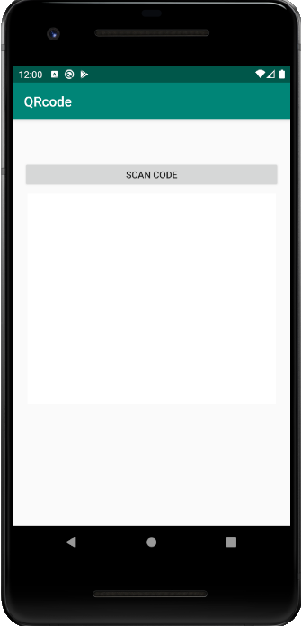

# Leitor de QR Code e Bar Code

### Introdução

---

O Leitor de QR Code é um aplicativo android feito para ler  e gerar QR Codes e Bar Codes. Esse aplicativo foi construído durante uma aula de Desenvolvimento para Android II promovido pela Pós Graduação em Dispositivos Móveis na Universidade Potiguar.

### Funcionamento

---

Ao executar a aplicação, o usuário é apresentado à tela principal do leitor de QR Code. A tela possui um botão que inicia o scan do QR code ou do Bar Code:

